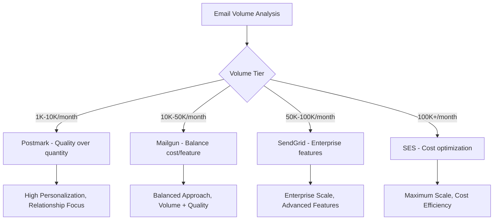

# Provider Selection Framework

Structured approach to selecting the optimal ESP based on email volume and use case requirements.

## Volume-Based Provider Selection

### Selection Diagram

### Provider Selection Matrix

| Volume Tier | Primary Provider | Secondary Option | Key Considerations |
|-------------|------------------|------------------|-------------------|
| **1K-10K/month** | Postmark | Mailgun | Quality focus, relationship building |
| **10K-50K/month** | Mailgun | SendGrid | Feature balance, cost consideration |
| **50K-100K/month** | SendGrid | Mailgun | Enterprise features, IP management |
| **100K+/month** | Amazon SES | SendGrid | Cost optimization, technical capacity |

## Use Case-Based Provider Selection

### Cold Email Campaigns

| Priority | Provider | Reason |
|----------|----------|--------|
| 1st | Mailgun | Cold email specific features and optimizations |
| 2nd | SendGrid | Enterprise features, IP management |
| 3rd | Amazon SES | Cost effective at scale |
| Not Recommended | Postmark | Transactional focus only |

### Transactional Emails

| Priority | Provider | Reason |
|----------|----------|--------|
| 1st | Postmark | Highest deliverability for transactional |
| 2nd | SendGrid | Good transactional support |
| 3rd | Mailgun | Capable but not specialized |

### High-Volume Campaigns

| Priority | Provider | Reason |
|----------|----------|--------|
| 1st | Amazon SES | 50-80% cost savings at scale |
| 2nd | SendGrid | Enterprise features |
| 3rd | Mailgun | Good value |

## Cost Analysis

### Cost Per 10,000 Emails

| Provider | Cost | Best For |
|----------|------|----------|
| Amazon SES | $1.00 | High volume, cost-sensitive |
| Mailgun | $5.00 | Balanced cost/features |
| SendGrid | $8.00 | Enterprise features |
| Postmark | $10.00 | Maximum deliverability |

### Volume-Based Cost Comparison

| Volume | SendGrid | Mailgun | Postmark | Amazon SES |
|--------|----------|---------|----------|------------|
| 10,000 | $8 | $5 | $10 | $1 |
| 50,000 | $40 | $25 | $50 | $5 |
| 100,000 | $80 | $50 | $100 | $10 |
| 500,000 | $400 | $250 | $500 | $50 |

### Savings Analysis

| Scenario | Savings with SES |
|----------|------------------|
| 10K emails moving to SES | 70% savings |
| 50K emails moving to SES | 87.5% savings |
| 100K emails moving to SES | 90% savings |

## Decision Framework

### Quick Selection Guide

1. **Need highest deliverability?** → Postmark
2. **Sending cold emails?** → Mailgun
3. **Enterprise features required?** → SendGrid
4. **100K+ emails, cost matters?** → Amazon SES
5. **Technical team available?** → Amazon SES
6. **Want managed solution?** → SendGrid or Mailgun

---

**Related Documents:**
- [Overview](overview.md)
- [Technical Integration](technical-integration.md)
