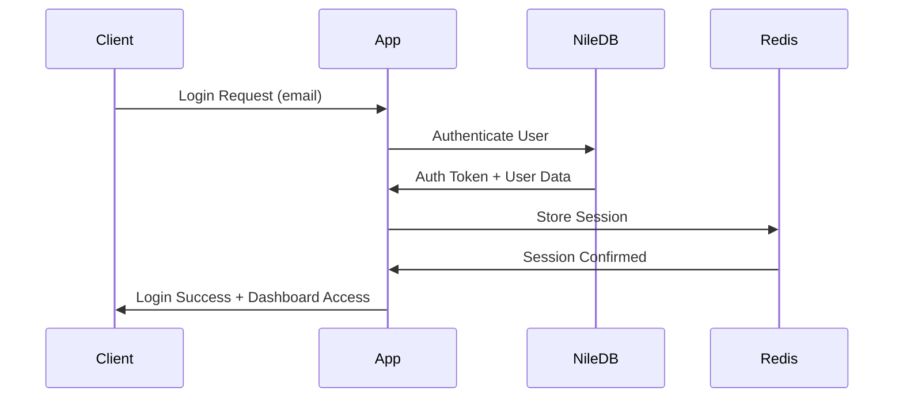

# Authentication & Authorization

NileDB handles core authentication while we maintain comprehensive security practices across all system components.

## NileDB Authentication Integration

### Authentication Flow



### Security Features

| Feature | Status |
|---------|--------|
| Managed Authentication | ✅ NileDB handles core auth (users table) |
| Session Management | ✅ Fully handled by NileDB |
| Email Verification | ✅ IMPLEMENTED using Loop service + custom endpoint |
| Password Reset | Planned alongside email verification |
| Multi-Factor Authentication | Not implemented (planned under feature flag) |
| Password Policies | Configurable through tenant_policies table (not enforced) |
| Account Lockout | Not implemented - relies on password reset flow |
| Failed Login Tracking | No tracking - users contact support |

### Implementation Example

```javascript
// Authentication middleware
const authenticateUser = async (req, res, next) => {
  try {
    const token = req.headers.authorization?.replace('Bearer ', '');

    if (!token) {
      return res.status(401).json({ error: 'No token provided' });
    }

    // Verify with NileDB
    const user = await nileDB.auth.verifyToken(token);

    if (!user) {
      return res.status(401).json({ error: 'Invalid token' });
    }

    // Check tenant access
    const tenantAccess = await checkTenantAccess(user.id, req.params.tenantId);

    if (!tenantAccess) {
      return res.status(403).json({ error: 'Access denied' });
    }

    req.user = user;
    req.tenant = tenantAccess;
    next();

  } catch (error) {
    logger.error('Authentication error:', error);
    res.status(401).json({ error: 'Authentication failed' });
  }
};
```

---

[← Back to Security Framework](./README)
