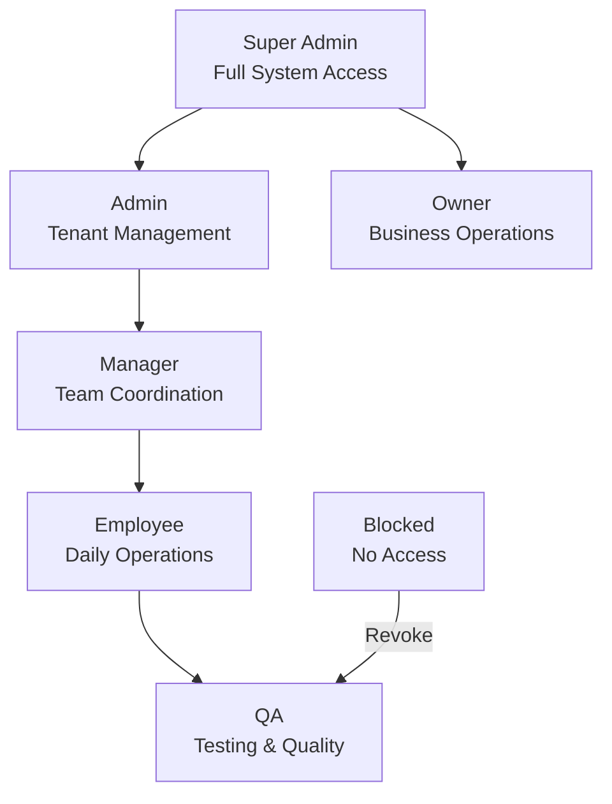

# Role-Based Access Control (RBAC)

Our 7-tier permission system provides granular access control across all platform features.

## Permission Hierarchy



## Permission Levels Detail

| Role | User Management | Billing | Email Config | Data Export | System Settings |
|------|----------------|---------|--------------|-------------|-----------------|
| **Super Admin** | Full | Full | Full | Full | Full |
| **Admin** | Tenant Users | Plans | Full | Full | Limited |
| **Owner** | Team Members | Payment History | Email Setup | Data Download | None |
| **Manager** | View Users | Usage Stats | Email Templates | Campaign Reports | None |
| **Employee** | Own Profile | None | Send Emails | Own Data | None |
| **QA** | None | None | Test Config | Test Data | None |
| **Blocked** | None | None | None | None | None |

## Implementation

```javascript
// Permission checking middleware
const checkPermission = (requiredPermission) => {
  return async (req, res, next) => {
    try {
      const userRole = req.user.role;
      const tenantId = req.tenant.id;

      // Check if user has required permission for tenant
      const hasPermission = await nileDB.permissions.check({
        userId: req.user.id,
        tenantId: tenantId,
        permission: requiredPermission,
        role: userRole
      });

      if (!hasPermission) {
        return res.status(403).json({
          error: 'Insufficient permissions'
        });
      }

      next();
    } catch (error) {
      logger.error('Permission check error:', error);
      res.status(500).json({ error: 'Permission verification failed' });
    }
  };
};

// Usage in routes
app.get('/api/tenant/:tenantId/users',
  authenticateUser,
  checkPermission('user_management'),
  getUsers
);
```

---

[← Back to Security Framework](./README)
