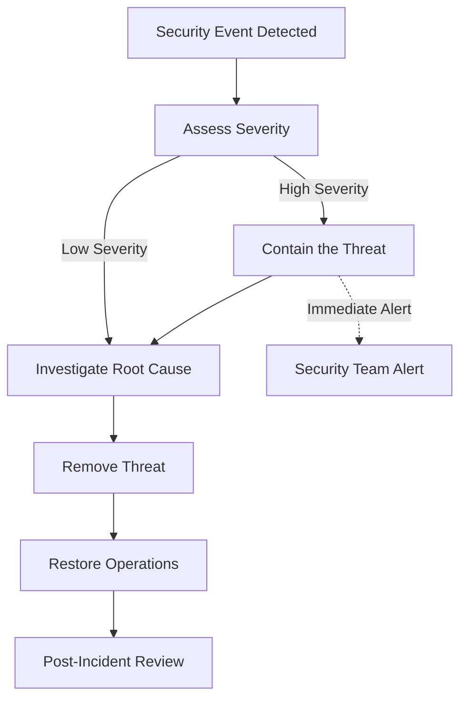

# Security Monitoring

Logging, auditing, and incident response procedures.

## Privileged Access Policy

All privileged staff roles (including super_admin, admin, support, and QA) operate under strict least-privilege policies. Every privileged action affecting tenant data, billing, authentication, or configuration MUST be logged with tenant context, resource identifiers, and sufficient metadata to satisfy SOC 2 and GDPR audit expectations.

## Logging & Auditing

### Security Event Logging

```javascript
// Security event logger
const securityLogger = {
  logEvent: async (event) => {
    const logEntry = {
      timestamp: new Date().toISOString(),
      event: event.type,
      userId: event.userId,
      tenantId: event.tenantId,
      ip: event.ip,
      userAgent: event.userAgent,
      details: event.details
    };

    // Log to secure storage
    await nileDB.security_logs.insert(logEntry);

    // Alert on critical events
    if (event.severity === 'critical') {
      await sendSecurityAlert(logEntry);
    }
  },

  // Track suspicious activities
  trackSuspiciousActivity: async (req, activity) => {
    const suspicious = {
      ip: req.ip,
      userAgent: req.get('User-Agent'),
      activity: activity,
      timestamp: new Date()
    };

    // Store for analysis
    await nileDB.suspicious_activities.insert(suspicious);
  }
};
```

### Audit Trail

```javascript
// Comprehensive audit logging
const auditLogger = {
  logAction: async (userId, tenantId, action, resource, details) => {
    const auditEntry = {
      id: uuid.v4(),
      user_id: userId,
      tenant_id: tenantId,
      action: action,
      resource: resource,
      details: details,
      timestamp: new Date(),
      ip_address: getClientIP(),
      user_agent: getUserAgent()
    };

    await nileDB.audit_log.insert(auditEntry);
  }
};
```

### Enhanced Audit Logging (Q4 2025)

**Current Enhancements Planned:**

- Multi-legislation compliance fields (GDPR, CCPA, PIPEDA, CASL)
- Legal basis tracking for GDPR compliance
- Cross-border transfer monitoring
- Enhanced retention management

Note: Some audit logging enhancements are scheduled for 2026 due to database storage constraints.

## Incident Response

### Security Incident Types

1. **Unauthorized Access**: Detected login from unusual locations
2. **Data Breach**: Suspicious data access or extraction
3. **System Compromise**: Malware or unauthorized system changes
4. **Email Abuse**: Spam or phishing from our infrastructure

### Response Procedures



---

[← Back to Security Framework](./README)
