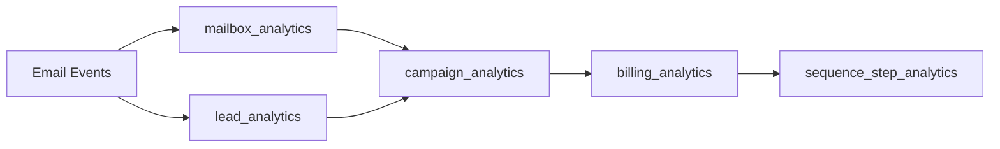

# OLAP Analytics Schema Guide

Strategic alignment and core analytics tables for the PenguinMails OLAP warehouse.

## Related Documentation

- [Analytics Tables](/docs/implementation-technical/database-infrastructure/olap-database/schema-guide/analytics-tables)
- [Administration & Governance](/docs/implementation-technical/database-infrastructure/olap-database/schema-guide/administration)

## Strategic Alignment

The OLAP analytics schema exists exclusively to power durable, business-critical analytics for PenguinMails. It is not used for live product state, notifications, or infrastructure logging.

### In Scope

- Aggregated metrics for campaigns, mailboxes, leads, warmups
- Billing and usage analytics
- Compliance-relevant audit summaries
- Long-term trend and BI queries

### Out of Scope

- User-facing notifications
- Live system events/incidents
- Raw logs, infra metrics, rate limits, or queue/job internals
- Heavy content (email bodies, attachments)

For those concerns:
- Notifications & system events: see [Notifications Database Schema Guide](/docs/implementation-technical/database-infrastructure/notifications-database-schema-guide)
- External logging / observability: see [External Analytics Logging](/docs/implementation-technical/database-infrastructure/operations/external-analytics-logging)

## OLTP vs OLAP Separation of Concerns

### What Lives in OLTP (Operational Billing)

| Entity | Examples |
|--------|----------|
| Subscription records | subscriptions, plans, payments |
| Stripe object references | stripe_subscription_id, stripe_product_id |
| Current subscription state | status, current_period_end |
| Billing lifecycle | cancel_reason, cancel_date |

### What Lives in OLAP (Analytics)

| Entity | Examples |
|--------|----------|
| Email campaign metrics | campaign_analytics.sent, delivered, opened |
| Mailbox performance | mailbox_analytics.health_score |
| Lead engagement | lead_analytics.replied |
| Aggregated usage | billing_analytics.emails_sent |

### How Billing Uses Analytics

When billing needs analytics data (e.g., usage-based billing checks):

```typescript
// ✅ CORRECT: Query OLAP from billing controller
const usage = await olapClient.query(`
  SELECT SUM(sent) as total_sent
  FROM campaign_analytics
  WHERE tenant_id = $1 
    AND updated >= $2 
    AND updated < $3
`, [tenantId, periodStart, periodEnd]);

if (usage.total_sent > currentPlan.max_emails_per_month) {
  // Handle overage
}
```

**Anti-pattern:** Don't duplicate analytics in billing tables - this violates separation of concerns.

## Core Analytics Tables

The OLAP warehouse contains the following canonical tables:

| Table | Purpose |
|-------|---------|
| billing_analytics | Usage aggregation per tenant per period |
| campaign_analytics | Per-campaign performance for reporting |
| mailbox_analytics | Mailbox deliverability, health, warmup |
| lead_analytics | Per-lead engagement for scoring/segmentation |
| warmup_analytics | Warmup performance and reputation metrics |
| sequence_step_analytics | Step-level performance for A/B testing |
| admin_audit_log | Compliance-focused audit log |

## Update Process & Data Freshness

OLAP tables are updated via queued batch jobs, NOT real-time:

**Aggregation Schedule:**
- Daily batch jobs (typically 2 AM UTC)
- Weekly rollup jobs (Sundays for week-over-week analytics)

**Dependency Chain:**



**Implications:**
- Usage numbers may be 1-24 hours behind real-time activity
- Always display `updated` timestamp on analytics dashboards
- For real-time subscription status, query OLTP `subscriptions` table

---

**Last Updated:** November 17, 2025
