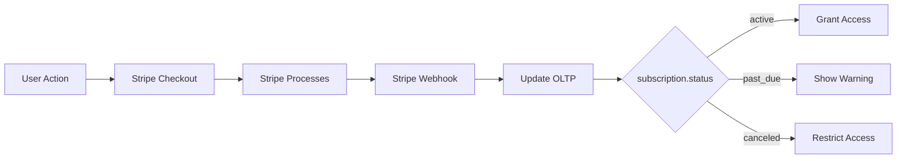

# Billing and Subscription Tables

PenguinMails follows a Stripe-first approach for payment processing. The OLTP layer stores minimal references for access control while Stripe handles the full payment lifecycle, invoice generation, and PCI compliance.

## Payment Architecture Philosophy

Stripe manages payment processing, subscription billing, invoice generation, and dunning. PenguinMails OLTP stores only the references needed for access control and tenant status.

### What Stripe Manages

- Payment processing with secure card storage (PCI compliance)
- Subscription billing lifecycle (create, update, cancel)
- Invoice generation and PDF rendering
- Payment retry logic and dunning
- Refund processing and payment history
- Customer portal for self-service billing

### What OLTP Stores

- Operational references (`stripe_subscription_id`, `stripe_payment_intent_id`)
- Minimal status for access control (`status`, `current_period_end`)
- Linking data (subscription to tenant, subscription to plan)

This separation keeps OLTP records small and fast while Stripe serves as the single source of truth for payment details.

## Three-Tier Payment Data Architecture

**Tier 1 (OLTP)**: Operational subscription references, access control, real-time subscription state.

**Tier 2 (OLAP Analytics)**: Usage aggregation like emails sent and domains used. Updated via daily batch jobs, not real-time.

**Tier 3 (Stripe Dashboard)**: Full payment transaction history, invoice PDFs, refund processing.

## plans Table

Plans define subscription tiers with feature limits and pricing. The `stripe_product_id` links to Stripe for checkout and customer portal integration.

```sql
CREATE TABLE plans (
    id UUID PRIMARY KEY DEFAULT gen_random_uuid(),
    name VARCHAR(100) NOT NULL,
    slug VARCHAR(100) NOT NULL UNIQUE,
    description TEXT,
    max_users INTEGER,
    max_domains INTEGER,
    max_campaigns_per_month INTEGER,
    api_rate_limit INTEGER,
    max_email_accounts INTEGER,
    max_emails_per_month INTEGER,
    max_warmups INTEGER,
    max_contacts INTEGER,
    max_storage_gb INTEGER,
    api_access BOOLEAN DEFAULT FALSE,
    priority_support BOOLEAN DEFAULT FALSE,
    advanced_analytics BOOLEAN DEFAULT FALSE,
    white_label BOOLEAN DEFAULT FALSE,
    price_monthly INTEGER,
    price_yearly INTEGER,
    notes TEXT,
    is_active BOOLEAN DEFAULT TRUE,
    stripe_product_id VARCHAR(255),
    created TIMESTAMP WITH TIME ZONE DEFAULT NOW(),
    updated TIMESTAMP WITH TIME ZONE DEFAULT NOW()
);

CREATE INDEX idx_plans_stripe_product
    ON plans(stripe_product_id)
    WHERE stripe_product_id IS NOT NULL;
```

### Why stripe_product_id Instead of stripe_price_id

The Product ID enables "View Plan in Stripe" links and Customer Portal redirects. Product IDs remain stable when prices change, unlike Price IDs which change with each price update.

Stripe manages all pricing through Checkout. PenguinMails displays `price_monthly` and `price_yearly` from the local database, then redirects to Stripe Checkout when users subscribe. Stripe handles price selection, proration, and payment collection.

### Plan Lifecycle with is_active

Active plans (`is_active = true`) appear in purchase options and accept new subscriptions.

Inactive plans (`is_active = false`) are hidden from purchase UI but allow existing subscribers to renew. This supports several business scenarios:

- **Seasonal plans**: Deactivate "Black Friday 2025" after November, reactivate next year
- **Exclusive plans**: "Founder Plan" for early adopters only, inactive but renewable
- **A/B testing**: Test new pricing tiers, deactivate underperformers
- **Grandfathered pricing**: Lock in special pricing for loyal customers

## subscriptions Table

Subscriptions link tenants to plans with billing period tracking. The `stripe_subscription_id` connects to Stripe for state management.

```sql
CREATE TABLE subscriptions (
    id UUID PRIMARY KEY DEFAULT gen_random_uuid(),
    tenant_id UUID REFERENCES tenants(id) ON DELETE CASCADE,
    plan_id UUID REFERENCES plans(id),
    pending_plan_id UUID REFERENCES plans(id),
    status VARCHAR(50) CHECK (status IN ('active', 'past_due', 'canceled', 'unpaid')),
    current_period_start TIMESTAMP WITH TIME ZONE,
    current_period_end TIMESTAMP WITH TIME ZONE,
    cancel_at_period_end BOOLEAN DEFAULT FALSE,
    cancel_reason TEXT,
    cancel_date TIMESTAMP WITH TIME ZONE,
    billing_contact_user_id UUID REFERENCES users(id),
    stripe_subscription_id VARCHAR(255),
    created TIMESTAMP WITH TIME ZONE DEFAULT NOW(),
    updated TIMESTAMP WITH TIME ZONE DEFAULT NOW()
);
```

The `pending_plan_id` field supports plan changes scheduled for the next billing cycle. When a tenant upgrades or downgrades, the new plan takes effect at `current_period_end`, preventing proration complexity.

The `billing_contact_user_id` allows tenants to designate a billing administrator separate from the account owner.

## subscription_addons Table

Addons extend subscriptions with additional features beyond the base plan.

```sql
CREATE TABLE subscription_addons (
    id VARCHAR(255) PRIMARY KEY,
    subscription_id UUID REFERENCES subscriptions(id) ON DELETE CASCADE,
    addon_type VARCHAR(50) NOT NULL,
    quantity INTEGER DEFAULT 1,
    price_monthly DECIMAL(10,2),
    stripe_price_id VARCHAR(255),
    is_active BOOLEAN DEFAULT TRUE,
    created TIMESTAMP WITH TIME ZONE DEFAULT NOW(),
    updated TIMESTAMP WITH TIME ZONE DEFAULT NOW()
);
```

Common addon types include extra email accounts, additional domains, increased API rate limits, and premium support tiers. The `quantity` field supports metered addons like per-domain pricing.

## payments Table

Payments store minimal references for audit trails and quick lookups. Full transaction details live in Stripe.

```sql
CREATE TABLE payments (
    id UUID PRIMARY KEY DEFAULT gen_random_uuid(),
    subscription_id UUID REFERENCES subscriptions(id) ON DELETE CASCADE,
    initiated_by_user_id UUID REFERENCES users(id),
    amount DECIMAL(10,2) NOT NULL,
    currency VARCHAR(3) DEFAULT 'USD',
    status VARCHAR(20) NOT NULL,
    processed TIMESTAMP WITH TIME ZONE,
    description TEXT,
    stripe_payment_intent_id VARCHAR(255),
    billing_period_start TIMESTAMP WITH TIME ZONE,
    billing_period_end TIMESTAMP WITH TIME ZONE,
    created TIMESTAMP WITH TIME ZONE DEFAULT NOW()
);
```

The `stripe_payment_intent_id` is the primary purpose of this table. It links to Stripe Dashboard for full payment details at `https://dashboard.stripe.com/payments/{stripe_payment_intent_id}`.

The `amount`, `currency`, and `status` fields provide basic display data for tenant dashboards without requiring Stripe API calls. Receipt URLs, refund details, and payment method information come from Stripe when needed.

## Payment Data Flow



Stripe webhooks drive all state changes. When Stripe processes a payment, it sends webhooks that update OLTP status. Application code checks `subscription.status` for access control decisions.

## Related Documentation

- [Schema Overview](overview)
- [Infrastructure Management](infrastructure)
- [Performance and Security](performance-security)
