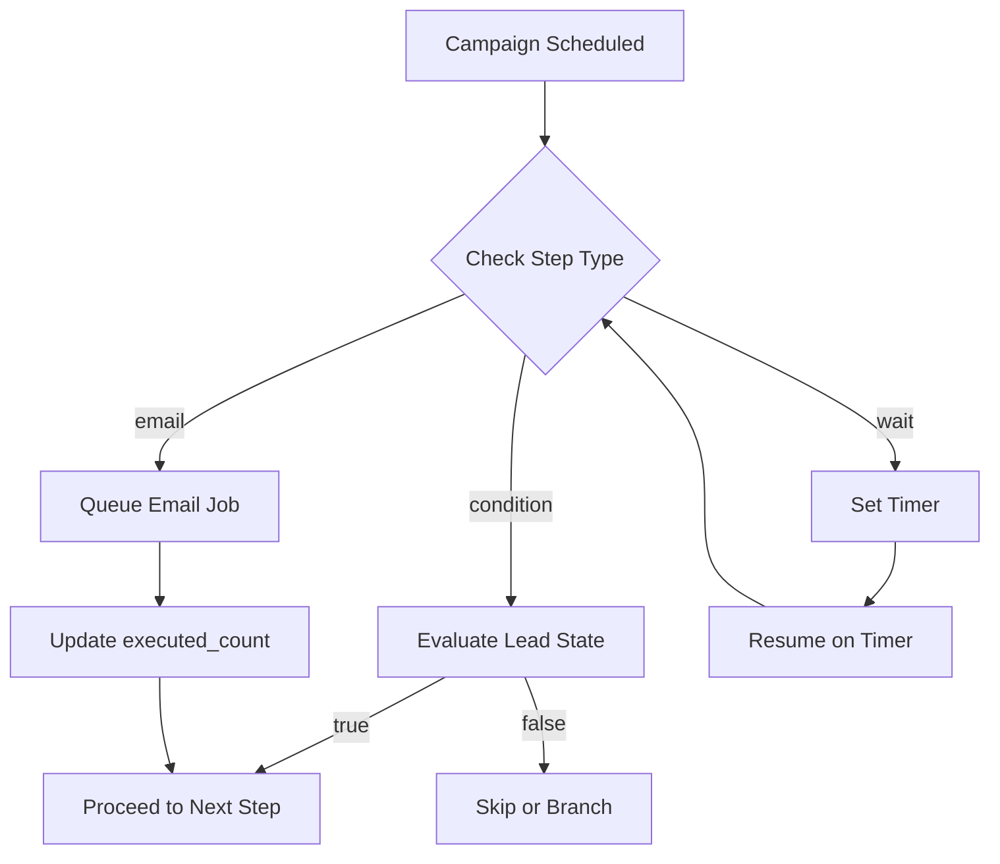

# Campaign Management Tables

Campaign tables orchestrate multi-step email sequences with conditional logic and scheduling. The OLTP layer handles campaign metadata and step definitions while the Content Database stores actual message content and analytics.

## campaigns Table

Campaigns represent email sequences targeting specific leads. Each campaign progresses through lifecycle states from draft to completion.

```sql
CREATE TABLE campaigns (
    id UUID PRIMARY KEY DEFAULT gen_random_uuid(),
    tenant_id UUID NOT NULL,
    company_id UUID REFERENCES companies(id) ON DELETE CASCADE,
    name VARCHAR(200) NOT NULL,
    description TEXT,
    status VARCHAR(50) CHECK (status IN ('draft', 'scheduled', 'sending', 'completed', 'paused')),
    scheduled TIMESTAMP WITH TIME ZONE,
    completed TIMESTAMP WITH TIME ZONE,
    created TIMESTAMP WITH TIME ZONE DEFAULT NOW(),
    updated TIMESTAMP WITH TIME ZONE DEFAULT NOW()
);
```

The `status` field controls campaign behavior in the execution engine. Campaigns in `draft` status remain editable, while `scheduled` campaigns await their start time. The `sending` status indicates active processing, and `paused` allows temporary suspension without losing progress.

## campaign_sequence_steps Table

Sequence steps define individual actions within a campaign. Each step executes in order, supporting email sends, wait periods, and conditional branching.

```sql
CREATE TABLE campaign_sequence_steps (
    id UUID PRIMARY KEY DEFAULT gen_random_uuid(),
    campaign_id UUID REFERENCES campaigns(id) ON DELETE CASCADE,
    step_order INTEGER NOT NULL,
    step_type VARCHAR(50) CHECK (step_type IN ('email', 'wait', 'condition')),
    email_account_id UUID REFERENCES email_accounts(id),
    template_id UUID REFERENCES templates(id),
    subject_override VARCHAR(500),
    from_name_override VARCHAR(100),
    wait_duration_hours INTEGER,
    wait_until_date TIMESTAMP WITH TIME ZONE,
    condition_type VARCHAR(50),
    condition_value VARCHAR(100),
    send_condition TEXT,
    is_active BOOLEAN DEFAULT TRUE,
    executed_count INTEGER DEFAULT 0,
    last_executed TIMESTAMP WITH TIME ZONE,
    created TIMESTAMP WITH TIME ZONE DEFAULT NOW(),
    updated TIMESTAMP WITH TIME ZONE DEFAULT NOW()
);
```

### Step Types

The `step_type` field determines how the execution engine processes each step:

**Email steps** send messages using the referenced template and email account. Override fields allow per-step customization of subject lines and sender names without modifying the base template.

**Wait steps** pause sequence execution for a duration or until a specific date. The `wait_duration_hours` field supports relative delays, while `wait_until_date` enables absolute scheduling for time-sensitive campaigns.

**Condition steps** evaluate lead behavior before proceeding. Common conditions include checking whether a lead opened a previous email, clicked a link, or replied. The `send_condition` field stores complex expressions for advanced branching logic.

### Execution Tracking

The `executed_count` and `last_executed` fields support analytics and debugging. These counters help identify bottlenecks in campaign performance and verify that steps execute as expected.

Individual email send analytics (opens, clicks, bounces) are stored in the Content Database rather than OLTP. This separation keeps the transactional layer fast while the content layer handles heavy analytics writes.

## Campaign Execution Flow



The queue system handles email job processing asynchronously. When a step completes, the execution engine advances `step_order` and evaluates the next step in sequence.

## Related Documentation

- [Schema Overview](overview)
- [Business Logic Tables](business-logic)
- [Infrastructure Management](infrastructure)
