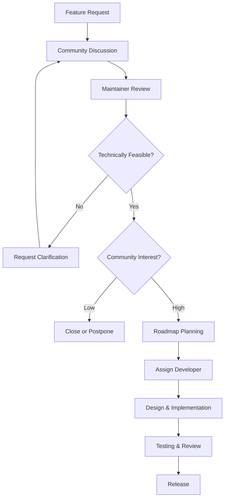

# Feature Request Process & Templates

Guidelines for submitting feature requests, understanding the approval workflow, and using standardized templates.

## Before Submitting a Feature Request

### Research Phase

1. **Check existing issues** and documentation for similar features
2. **Review roadmap** for planned features that may address your need
3. **Search discussions** for similar ideas from other contributors
4. **Understand impact** on existing features and architecture

### Proposal Guidelines

- **Problem-solution fit**: Clearly identify the problem being solved
- **User impact**: Who benefits and how their workflow improves
- **Technical feasibility**: Initial assessment of implementation complexity
- **Resource requirements**: Estimated development effort needed

## Feature Request Template

Use this template when submitting feature requests:

```markdown
## Feature Description

Clear description of the proposed feature.

## Problem Statement

What problem does this feature solve? Who experiences this problem?

## Proposed Solution

Describe your proposed solution in detail.

## Alternative Solutions

Describe any alternative solutions you've considered.

## User Stories

As a [type of user], I want [goal] so that [benefit].

## Technical Considerations

- Implementation complexity: [Low/Medium/High]
- Database changes required: [Yes/No]
- API changes required: [Yes/No]
- Security implications: [Description]
- Performance impact: [Description]

## Mockups/Examples

If applicable, provide mockups or examples of the feature.

## Acceptance Criteria

- [ ] Criterion 1
- [ ] Criterion 2
- [ ] Criterion 3

## Additional Context

Any additional information about the feature request.
```

## Feature Approval Process



### Approval Stages

**Stage 1: Community Discussion**
- Feature request is submitted and visible to community
- Contributors can comment, ask questions, and express interest
- Discussion helps refine the proposal and identify edge cases

**Stage 2: Maintainer Review**
- Technical leads assess implementation feasibility
- Resource requirements are estimated
- Alignment with product vision is evaluated

**Stage 3: Roadmap Planning**
- Approved features are prioritized against other work
- Timeline and milestone assignment
- Developer assignment based on expertise

**Stage 4: Design & Implementation**
- Detailed technical design document created
- Implementation follows coding standards
- Regular progress updates in the feature request issue

**Stage 5: Review & Release**
- Code review by at least 2 developers
- Comprehensive testing (unit, integration, e2e)
- Staged rollout with monitoring

## Feature Branches

```bash
# Create feature branch with descriptive name
git checkout -b feature/ai-email-optimization
git checkout -b feature/advanced-analytics-dashboard
git checkout -b feature/mobile-app-integration

# Make incremental commits with conventional commit messages
git commit -m "feat(ai): add email subject line optimization algorithm"
git commit -m "test(ai): add unit tests for optimization model"
git commit -m "docs: update API documentation for AI features"
```

## Priority Levels

| Priority | Description | Typical Timeline |
|----------|-------------|------------------|
| P0 - Critical | Security issues, breaking changes | Immediate |
| P1 - High | Major user-requested features | Current sprint |
| P2 - Medium | Quality of life improvements | Next 1-2 sprints |
| P3 - Low | Nice-to-have enhancements | Backlog |

## Related Documentation

- [Implementation Standards](./implementation) - Coding patterns and examples
- [Feature Categories](./categories) - Types of features and patterns
- [Development Guidelines](./guidelines) - Quality gates and checklists
