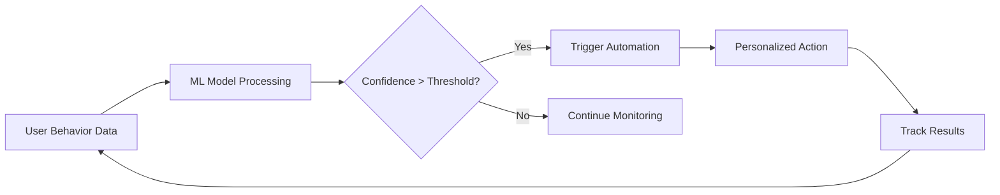

# Behavioral Trigger System

Event-based and predictive triggering for personalized automation.

## Event-Based Triggering

**Primary Objective:** Implement comprehensive event-based triggering for personalized automation

### Website Events

```typescript
interface WebsiteEvents {
  page_views: {
    tracking_method: 'javascript_sdk';
    data_capture: ['page_url', 'referrer', 'time_on_page'];
    trigger_conditions: ['specific_pages', 'url_patterns', 'visit_frequency'];
  };

  form_submissions: {
    form_types: ['contact', 'newsletter', 'lead_gen', 'support'];
    field_validation: true;
    auto_enrichment: 'from_website_data';
    crm_integration: 'immediate';
  };

  button_clicks: {
    tracked_actions: ['cta_clicks', 'downloads', 'video_plays'];
    data_enrichment: 'context_aware';
    personalization: 'content_based';
  };
}
```

### Email Events

| Event | Tracking Method | Features |
|-------|-----------------|----------|
| Opens | Tracking pixel | Frequency, device detection, time tracking |
| Clicks | Link tracking | UTM preservation, click path analysis, conversion tracking |
| Replies | Email reply tracking | Sentiment analysis, routing rules |

### Social Events

| Event | Platforms | Features |
|-------|-----------|----------|
| Mentions | Twitter, Facebook, LinkedIn | Response automation, sentiment analysis, escalation |
| Shares | All platforms | Share tracking, amplification scoring, advocate identification |

## Predictive Triggering

**Primary Objective:** Implement AI-powered predictive triggering for proactive automation

### Machine Learning Models

**Churn Prediction:**

| Property | Value |
|----------|-------|
| Algorithm | Random Forest |
| Features | engagement_score, usage_frequency, support_tickets |
| Update Frequency | Weekly |
| Confidence Threshold | 0.8 |

**Purchase Intent:**

| Property | Value |
|----------|-------|
| Algorithm | Gradient Boosting |
| Features | page_views, email_engagement, product_interactions |
| Update Frequency | Daily |
| Confidence Threshold | 0.75 |

**Content Interest:**

| Property | Value |
|----------|-------|
| Algorithm | Collaborative Filtering |
| Features | content_views, time_spent, sharing_behavior |
| Update Frequency | Real-time |
| Confidence Threshold | 0.7 |

### Trigger Automation

```typescript
interface TriggerAutomation {
  proactive_re_engagement: {
    trigger: 'predicted_churn_risk > 0.7';
    action: 'personalized_retention_campaign';
    personalization: 'churn_risk_factors';
  };

  purchase_optimization: {
    trigger: 'purchase_intent_score > 0.8';
    action: 'targeted_offer_presentation';
    timing: 'optimal_purchase_window';
  };

  content_recommendation: {
    trigger: 'content_interest_prediction';
    action: 'personalized_content_sequence';
    sequencing: 'interest_progression';
  };
}
```

### Predictive Trigger Flow



---

**Last Updated:** December 4, 2025
